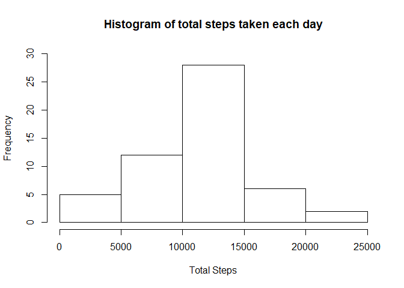
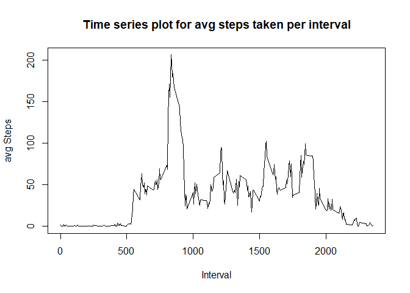
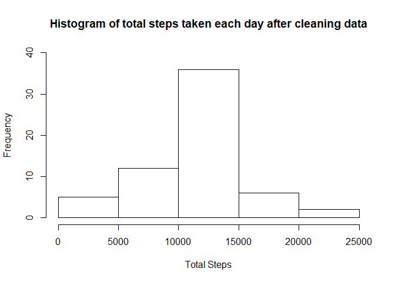
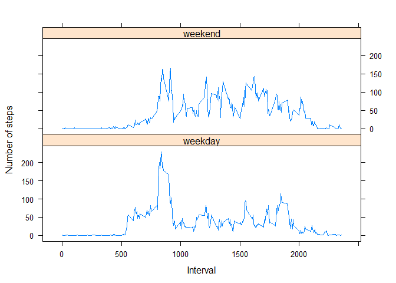

Loading and preprocessing the data
----------------------------------

Here, we will load the dataset and check the summary.

I had already extracted the data from the zipped file when I downloaded
it. So I will directly load the data from my working directory in this
code chunk.

``` r
setwd("C:/Users/Intel/Documents/Datasets/Activity")
activity <- read.csv("activity.csv")
summary(activity)
```

    ##      steps                date          interval     
    ##  Min.   :  0.00   2012-10-01:  288   Min.   :   0.0  
    ##  1st Qu.:  0.00   2012-10-02:  288   1st Qu.: 588.8  
    ##  Median :  0.00   2012-10-03:  288   Median :1177.5  
    ##  Mean   : 37.38   2012-10-04:  288   Mean   :1177.5  
    ##  3rd Qu.: 12.00   2012-10-05:  288   3rd Qu.:1766.2  
    ##  Max.   :806.00   2012-10-06:  288   Max.   :2355.0  
    ##  NA's   :2304     (Other)   :15840

From the above summary, we can see that the “Steps” column contains NAs.
We will keep them as it is and while calculating the mean and median, we
will ignore NA.

What is the mean total number of steps take per day ?
-----------------------------------------------------

### We will first make a histogram of the total number of steps taken per day.

After scrolling through the data, we can see that each day is divided
into multiple intervals and the “steps” column shows the number of steps
taken in each interval.

To create a histogram, we will create a new table where we drop the
“intervals” column and display only the total number of steps taken
every day.

``` r
totalStepsPerDay <- aggregate(steps ~ date, activity, sum, na.rm=TRUE)
head(totalStepsPerDay)
```

    ##         date steps
    ## 1 2012-10-02   126
    ## 2 2012-10-03 11352
    ## 3 2012-10-04 12116
    ## 4 2012-10-05 13294
    ## 5 2012-10-06 15420
    ## 6 2012-10-07 11015

Here, we can see that the new table has dropped the entry for the date
2012-10-01. This is because all the entries in the steps column for this
day were NA.

Now we will plot the histogram

``` r
hist(totalStepsPerDay$steps, main = "Histogram of total steps taken each day",
     xlab = "Total Steps", 
     ylim = c(0, 30))
```



### Calculating and displaying the mean and the median

``` r
cat("The mean is: ", mean(totalStepsPerDay$steps), "\n̥")
```

    ## The mean is:  10766.19 
    ## <U+0325>

``` r
cat("The median is: ", median(totalStepsPerDay$steps))
```

    ## The median is:  10765

What is the average daily activity pattern?
-------------------------------------------

Here we need to plot the time series plots for average number of steps
taken. But these plots are with respect to the intervals and not dates.
So we create a new table which drops the date column and contains the
average number of steps for each interval.

We do this in the same way we made the totalStepsPerDay table above.

``` r
avgStepsPerInterval <- aggregate(steps ~ interval, activity, mean, na.rm=TRUE)
head(avgStepsPerInterval)
```

    ##   interval     steps
    ## 1        0 1.7169811
    ## 2        5 0.3396226
    ## 3       10 0.1320755
    ## 4       15 0.1509434
    ## 5       20 0.0754717
    ## 6       25 2.0943396

Now we plot the average steps

``` r
plot(avgStepsPerInterval$interval, avgStepsPerInterval$steps, type = "l", 
     main = "Time series plot for avg steps taken per interval", 
     xlab = "Interval",
     ylab = "avg Steps")
```



Now, we need to find the interval which has the maximum number of
average steps

We can see from the above figure that the max number occurs somewhere
between 500 and 1000. This would serve as a good point to check the
validity of our result.

``` r
maxStepsInterval <- avgStepsPerInterval[which.max(avgStepsPerInterval$steps), ]$interval
cat("The interval with the max average steps is: ", maxStepsInterval)
```

    ## The interval with the max average steps is:  835

We can see the answer is between 500 and 1000 as we discussed above.
This means our analysis is correct.

Inputting missing values
------------------------

We saw from our first code chunk that there are several NA values in the
steps column of our original data. Here we will replace the NA values
with some number

### Strategy for replacing the NA values

As the NA values are in the “steps” column, we can take replace them in
two ways

1.  Make all the NA values as 0. This will indicate that the person is
    sedentary during the whole day. Although this seems a resonable
    option, this shouldn’t be considered here as it is impossible to not
    take a single step in a whole day for a person without any serious
    disabilities. This option will skew our data to the left and it
    would be easier if we drop the first day completely.

2.  Another option is to replace the values with the average values for
    that interval. We already have this data in the above code chunk.
    This might also a data which a closer to the actual scenario.

``` r
# First copy the original data in a new table
cleanedActivity <- activity

# Check to see if the steps value is NA and replace it with average value if
# TRUE

for(i in 1:nrow(cleanedActivity)){
    if(is.na(cleanedActivity[i,]$steps)){
        cleanedActivity[i,]$steps <- avgStepsPerInterval[cleanedActivity[i,]$interval == avgStepsPerInterval$interval, ]$steps
    }
}
```

On checking the data, we can see that the NAs in step column have been
replaced average steps according to the interval.

But, we can also see that some values are floats and some are integers.
We need a to make all values as integers as it would simplify further
analysis.

``` r
cleanedActivity$steps <- as.integer(cleanedActivity$steps)
class(cleanedActivity$steps)
```

    ## [1] "integer"

Now, our new data set is ready.

### Plotting the histogram for new data

``` r
totalStepsPerDayClean <- aggregate(steps ~ date, cleanedActivity, sum, na.rm=TRUE)

hist(totalStepsPerDayClean$steps, 
     main = "Histogram of total steps taken each day after cleaning data",
     xlab = "Total Steps", 
     ylim = c(0, 40))
```



### Calculating the mean and median of cleaned data

``` r
cat("The mean is: ", mean(totalStepsPerDayClean$steps), "\n̥")
```

    ## The mean is:  10749.77 
    ## <U+0325>

``` r
cat("The median is: ", median(totalStepsPerDayClean$steps))
```

    ## The median is:  10641

Here the difference between our cleaned data and the previous data is

``` r
cat("difference between means: ", mean(totalStepsPerDayClean$steps) - mean(totalStepsPerDay$steps), "\n")
```

    ## difference between means:  -16.41819

``` r
cat("difference between medians: ", median(totalStepsPerDayClean$steps) - median(totalStepsPerDay$steps), "\n")
```

    ## difference between medians:  -124

The negative values indicate that our distribution has shifted to the
left after cleaning the data. This goes according to our intuition as
more values are considered.

Are there differences in activity patterns on Weekdays and Weekends?
--------------------------------------------------------------------

To check this, we first need to check the format of the date column of
the cleaned data.

``` r
class(cleanedActivity$date)
```

    ## [1] "factor"

Observe that it is a factor. We need to convert it to date-time data so
that we can use the Weekdays() function.

``` r
cleanedActivity$date <- as.Date(strptime(cleanedActivity$date, format="%Y-%m-%d"))
```

Now, we can use the Weekdays function and convert all the dates to
either “Weekdays or”Weekends" using a for loop.

``` r
cleanedActivity$day <- weekdays(cleanedActivity$date)
for (i in 1:nrow(cleanedActivity)) {
    if (cleanedActivity[i,]$day == "Saturday" | cleanedActivity[i,]$day == "Sunday") {
        cleanedActivity[i,]$day<-"weekend"
    }
    else{
        cleanedActivity[i,]$day<-"weekday"
    }
}
WeekdayVSWeekend <- aggregate(cleanedActivity$steps ~ cleanedActivity$interval + cleanedActivity$day, cleanedActivity, mean)

head(WeekdayVSWeekend)
```

    ##   cleanedActivity$interval cleanedActivity$day cleanedActivity$steps
    ## 1                        0             weekday            2.15555556
    ## 2                        5             weekday            0.40000000
    ## 3                       10             weekday            0.15555556
    ## 4                       15             weekday            0.17777778
    ## 5                       20             weekday            0.08888889
    ## 6                       25             weekday            1.57777778

Give proper names to the columns and conver the steps into integers

``` r
names(WeekdayVSWeekend) <- c("interval", "dayType", "steps")
WeekdayVSWeekend$steps <- as.integer(WeekdayVSWeekend$steps)
head(WeekdayVSWeekend)
```

    ##   interval dayType steps
    ## 1        0 weekday     2
    ## 2        5 weekday     0
    ## 3       10 weekday     0
    ## 4       15 weekday     0
    ## 5       20 weekday     0
    ## 6       25 weekday     1

Now we will plot the graphs

``` r
library(lattice)

xyplot(steps ~ interval | dayType,
       WeekdayVSWeekend, type = "l",
       layout = c(1, 2), 
       xlab = "Interval",
       ylab = "Number of steps")
```


